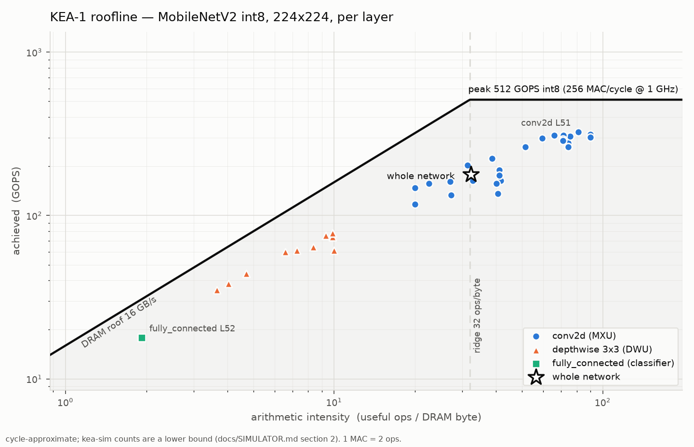

# KEA — an int8 NPU, its compiler, and its simulator

KEA-1 is a fictional but fully specified inference accelerator: a frozen
instruction set, a cycle-approximate simulator, an MLIR compiler that takes
quantized TOSA down to its instruction stream, and a PTQ frontend that produces
the TOSA. **MobileNetV2 int8 at 224×224 compiles through the whole stack and
runs on the simulator bit-exactly against a numpy reference.**

Nothing here runs on silicon. Every number in this file was produced by a
command in this repository and can be reproduced with it.

---

## 1. The machine

KEA-1 is a **statically scheduled, in-order, integer-only** accelerator. It has
no branches, no loops, no caches, and no hardware dependency tracking. The
compiler is responsible for correctness: every cross-unit dependency is an
explicit `SIGNAL` / `WAIT` on one of 32 counting semaphores.

| | |
|---|---|
| Clock | 1 GHz (nominal) |
| **MXU** | 16×16 systolic array, **256 int8 MAC/cycle** (512 int4), two weight banks |
| **DWU** | 16 lanes × 8 MACs, **128 int8 MAC/cycle**, 3×3 and 5×5 depthwise only |
| **VPU** | 16 elem/cycle — requantize, quantized add, pool, strided copy |
| **DMA0 / DMA1** | two engines sharing one **16 B/cycle** DRAM port |
| Scratchpads | `SPM_A` 256 KiB, `SPM_W` 256 KiB, `ACC` 32768 × int32 (word-addressed) |
| **IMEM** | 1 MiB = **32768 instructions**, fixed 32 B each. There is no loop instruction — a network is fully unrolled |
| Dispatch | one instruction per cycle, program order, into five depth-16 in-order queues |

Two consequences shape everything above it. First, **a full queue stalls the
dispatcher**, so a badly ordered instruction stream serialises the whole
machine. Second, **IMEM is a hard capacity limit on network size**, not a
performance knob — see §4.

Peak arithmetic: 512 GOPS int8 (1 MAC = 2 ops). Peak bandwidth: 16 GB/s. The
**ridge point is therefore 32 ops/byte** — a layer below that is memory bound
no matter how well it is scheduled.

`docs/ISA.md` is normative; `docs/MICROARCH.md` freezes the timing model.

---

## 2. The stack

```
model.py ──frontend──▶ model.kgraph.json + .npz
                           │  kea_frontend.tosa_emit
                           ▼
                     model.tosa.mlir
                           │
                        kea-opt   (tosa/linalg ─▶ kea ─▶ fuse ─▶ tile ─▶ alloc ─▶ schedule)
                           │
                        kea-translate
                           │
             ┌─────────────┼─────────────┐
             ▼             ▼             ▼
       model.kasm    model.weights.bin  model.map.json
        (assembly)     (constants)     (DRAM map, I/O
             │             │            tensors, metadata)
             └─────────────┼─────────────┘
                           ▼
                        kea-as
                           ▼
                       model.keaf  ──▶ kea-rt / kea-sim
```

(from [ADR-0001](docs/adr/0001-text-assembly-as-the-compiler-backend-boundary.md);
`keac` is a thin driver that runs the whole chain.)

**The text-assembly boundary is the load-bearing design decision.** The MLIR
half never writes binary and never links `isa.h`; the native half never links
MLIR. The payoff is that the scheduled, allocated, double-buffered instruction
stream is *readable*. §6 shows what that buys.

The `kea` dialect is deliberately two-level ([ADR-0002](docs/adr/0002-two-level-kea-dialect.md)):
Level 1 is value-semantic tensors with quantization as structured attributes;
Level 2 is buffers, addresses, events and machine ops. The ingest format is
**TOSA, not linalg**, precisely so the quantization survives exactly
(`docs/DIALECT_L1.md` §6).

---

## 3. Build and run

Toolchain: LLVM/MLIR **20.1.6 only** (`docs/TOSA_NOTES.md` §16 lists what breaks
on 21+), a C++17 compiler, and the venv described in `docs/PLATFORM.md`.

```sh
source scripts/env.sh
bash scripts/build_compiler.sh     # kea-opt, kea-translate + 32 tests   (~6 min)
bash scripts/build.sh              # kea-as, kea-dis, kea-sim, kea-rt, keac + 17 tests
.venv/bin/python -m pytest frontend/tests        # 92 tests
.venv/bin/python tools/keac/tests/numeric_check.py   # 7 layouts, bit-exact
```

The end-to-end demo — emit TOSA from the quantized graph, compile, simulate,
validate against golden vectors, and produce the roofline:

```sh
bash demo/run_all.sh          # ~90 s;  --quick skips the 52-layer A/B sweep
```

Compiling one model by hand:

```sh
# .kgraph.json -> TOSA MLIR
cd frontend && ../.venv/bin/python -m kea_frontend.tosa_emit \
    ../models/mobilenetv2_int8.kgraph.json -o /tmp/m.tosa.mlir \
    --function mnv2 --last-index 178

# TOSA -> .keaf, then run it
build/native/bin/keac /tmp/m.tosa.mlir --function mnv2 -o /tmp/m.keaf \
    --spm-reserve 1 --keep-intermediates
build/native/bin/kea-sim /tmp/m.keaf --stats-json /tmp/m.stats.json
```

---

## 4. Headline numbers, and the caveats that go with them

**MobileNetV2 int8, 224×224, batch 1**, `models/mobilenetv2_int8.kgraph.json`
(torchvision `IMAGENET1K_V1`, percentile observer, BN folded).

| | |
|---|---|
| Nodes compiled and run | **182 of 183** (the global average pool does not compile — see below) |
| Convolutions | **52 of 52** |
| Total cycles | **3,375,173** = 3.38 ms at 1 GHz |
| Useful arithmetic | 601.5 Mops (300.8 M MACs) |
| DRAM moved | 18.6 MB (11.9 MB read, 6.7 MB written) |
| Arithmetic intensity | **32.3 ops/byte** — right on the 32.0 ridge point |
| Achieved | **178.2 GOPS** of 512 attainable = **34.8%** |
| MXU MAC utilisation | **32.4%** of the 256 int8 MAC/cycle peak |
| MXU padding efficiency | 93.3% (useful ÷ issued MACs) |
| Numerical result | **bit-exact** vs the numpy reference on all 4 golden vectors, 4/4 argmax agreement |
| `--kea-schedule` A/B | **1.267×** over 53 layers compiled individually — but **0.951×** on the one 28-layer program it could be measured on |

**Caveats, in order of how much they matter.**

1. **The global average pool does not compile.** `-kea-tile` gives a pool's
   SPM_A tile the same buffer name as the DRAM buffer holding the pool's
   result, and `kea-translate` rejects duplicate names — so *every* `kea.pool`
   fails, in every program. The demo therefore runs the network as **two**
   `.keaf` programs with that one node executed on the host by the frontend's
   own reference kernel, and says so everywhere it reports a number. That node
   is 62,720 additions, 0.01% of the network's arithmetic, but it is not
   running on the NPU and the result is not a single-program inference.
   Reproducer: `demo/repro/pool_dram_name_collision.mlir`.
2. **`kea-sim` cycle counts are a lower bound.** Scratchpad port arbitration,
   DRAM row buffers, refresh and turnaround, and misalignment costs are all
   unmodelled (`docs/SIMULATOR.md` §2). Real LPDDR would cost 10–30% more on
   scattered access.
3. **The default SPM reserve factor does not fit.** At `spm-reserve-factor = 2`
   the feature extractor is **41,409 instructions** against a 32,768-instruction
   IMEM. At `--spm-reserve 1` it is **30,773** and fits, at the cost of larger
   tiles and less headroom for cross-layer double buffering. The demo uses
   `--spm-reserve 1` and reports both counts.
4. **`--kea-schedule` fails on the whole network**, and where it does run over
   many layers it is a regression. It produces a Rule D violation
   (`docs/ISA.md` §5.5) on any lowerable prefix of this model past node 97, so
   the A/B is measured **per layer** (1.267× aggregate, best 1.971×, two layers
   regress). On the largest prefix it does accept — 28 convolutions — it is
   **0.951×**, i.e. 5% slower than not scheduling at all. Both numbers are in
   `docs/RESULTS.md` §6; the per-layer one alone would be misleading.
   Reproducer: `demo/repro/run_repro.sh`, defect 3.
5. Accuracy figures for the quantized graph itself (67.9% top-1 on a
   1000-image Imagenette split, *not* ImageNet-1k) live in `docs/FRONTEND.md`
   §8 with their own caveats. This repository's contribution is that the
   compiled artifact reproduces the reference **exactly**, not that the
   reference is accurate.

Per-layer detail, the roofline plot and the full A/B table are in
**[`docs/RESULTS.md`](docs/RESULTS.md)** and `demo/results/`.



---

## 5. What the roofline says

The two layer families separate cleanly, which is the whole point of plotting
it:

| | arithmetic intensity | achieved | share of ops | share of layer-cycles | share of DRAM |
|---|---|---|---|---|---|
| 1×1 pointwise conv (MXU), 35 layers | 20.0 – 90.0 ops/B | 117 – 324 GOPS | 91.5% | 72.1% | 58.8% |
| 3×3 depthwise (DWU), 17 layers | **3.7 – 10.0 ops/B** | 35 – 78 GOPS | 8.1% | 23.9% | 34.6% |
| classifier `fully_connected` | **1.9 ops/B** | 17.9 GOPS | 0.4% | 4.0% | 6.6% |

All 17 depthwise layers and the classifier fall below the ridge point, and so
do six of the pointwise convolutions: **24 of 53 layers are memory bound**. A
depthwise 3×3 does 9 MACs
per input element regardless of channel count, so its intensity is fixed by the
kernel, not by the layer size; the classifier reads 1.28 MB of weights to do
1.28 M MACs and can never be anything but bandwidth limited. No amount of
scheduling moves those points up; only fusing them into their neighbours (so
the activation never round-trips through DRAM) would.

---

## 6. Why text assembly: a DMA visibly overlapping a MATMUL

This is `demo/results/schedule_excerpt.kasm` lines 42–58, the scheduled stream
for one 112×112 pointwise convolution. Long operand lists are wrapped and a few
stride fields elided as `…`; nothing is reordered. Three things are happening at
once: **DMA1 is storing the previous row band**,
**DMA0 is loading the next one** — between the two `MATMUL`s of the current one
— and `LOAD_W` alternates `bank=0` / `bank=1` so a weight load never waits for
the array:

```
  DMA1  DMA_ST  spm_space=SPM_A, dram_addr=@slice_6_7.0.out, spm_addr=a:172080,   <- previous band out
                len0=16, n1=112, n2=16, dram_s1=16, dram_s2=1792, spm_s1=16, spm_s2=1792
  DMA1  SIGNAL  event=8, inc=1
  MXU   WAIT    event=3, threshold=1
  MXU   WAIT    event=0, threshold=1
  MXU   MATMUL  a_addr=a:57360, a_inner_stride=32, a_outer_stride=3584, m_inner=112,
                m_outer=16, acc_addr=acc:0, …, bank=0, acc_mode=overwrite, dtype=int8
  MXU   LOAD_W  w_addr=w:256, w_row_stride=16, k_rows=16, n_cols=16, bank=1, dtype=int8
  DMA0  WAIT    event=7, threshold=1
  DMA0  WAIT    event=2, threshold=1
  DMA0  DMA_LD  spm_space=SPM_A, dram_addr=@slice_6_7.input0+114688,               <- next band in,
                spm_addr=a:114720, len0=3584, n1=16, n2=1, dram_s1=3584, …          mid-MATMUL
  DMA0  SIGNAL  event=0, inc=1
  MXU   MATMUL  a_addr=a:57376, a_inner_stride=32, a_outer_stride=3584, m_inner=112,
                m_outer=16, acc_addr=acc:0, …, bank=1, acc_mode=accumulate, dtype=int8
  MXU   SIGNAL  event=5, inc=1
  MXU   SIGNAL  event=6, inc=1
  MXU   SIGNAL  event=7, inc=1
  MXU   LOAD_W  w_addr=w:0, w_row_stride=16, k_rows=16, n_cols=16, bank=0, dtype=int8
  VPU   WAIT    event=5, threshold=1
  VPU   VQUANT  acc_addr=acc:0, out_addr=a:200768, qparam_addr=w:512, num_pixels=1792,
                channels=16, …, out_zp=-5, clamp_lo=-128, clamp_hi=127, dtype=int8
```

The unscheduled build of the same layer
(`demo/results/schedule_excerpt.unscheduled.kasm`) issues every `DMA_LD` on
DMA0, never touches DMA1, and puts a `WAIT` between every producer and
consumer. It takes 103,023 cycles; the version above takes 56,030 — **1.84×**.

You cannot review that property in a binary, and you cannot unit-test it
without a parser. That is the argument for the boundary.

---

## 7. Repository layout

```
include/kea/          the frozen ISA: hw_config.h, isa.h, program.h, keaf.h
compiler/             out-of-tree MLIR: the `kea` dialect, conversions,
  include/kea/        fuse/tile/schedule/alloc passes, the .kasm emitter
  lib/                    Dialect/ Conversion/ Transforms/ Target/Kasm
  tools/              kea-opt, kea-translate
  test/               lit tests (32)
sim/                  the cycle-approximate simulator (functional + timing)
runtime/              KEAF reader/writer, the .kasm assembler, kea-rt
tools/                kea-as, kea-dis, kea-sim, keac  (+ keac's e2e tests)
frontend/             PTQ: torch/ONNX -> .kgraph.json, the numpy golden model,
  kea_frontend/         and tosa_emit.py -- .kgraph.json -> TOSA MLIR
models/               the shipped quantized graphs (MobileNetV2, a tiny ViT)
tests/mlir/           verified TOSA and linalg examples for 20.1.6
tests/invariants/     cross-component invariants (e.g. requant equivalence)
demo/                 the end-to-end demo, its results, and bug reproducers
docs/                 the specifications; adr/ for the three decisions
```

---

## 8. Where to read next

| If you want | Read |
|---|---|
| the end-to-end result, per layer, with every caveat | **`docs/RESULTS.md`** |
| the instruction set | `docs/ISA.md`, then `docs/ISA_ERRATA.md` |
| the timing model the simulator implements | `docs/MICROARCH.md`, `docs/SIMULATOR.md` |
| what TOSA actually looks like on 20.1.6 | **`docs/TOSA_NOTES.md`** — machine-verified, trust it over upstream docs |
| the `kea` dialect | `docs/DIALECT_L1.md` (tensors), `docs/DIALECT_L2.md` (machine) |
| how conv becomes MATMULs | `docs/CODEGEN.md` |
| tiling, buffers, DRAM layout | `docs/MEMORY_PLANNING.md` |
| the list scheduler and its cost model | `docs/SCHEDULING.md` |
| requantization, bit-exactly | `docs/QUANTIZATION.md` + `docs/adr/0003-*` |
| quantization, calibration, accuracy | `docs/FRONTEND.md` |
| the `.kasm` and `.keaf` formats | `docs/ASSEMBLY.md`, `docs/ARTIFACT_FORMAT.md` |
| why the pipeline is shaped this way | `docs/adr/` |
